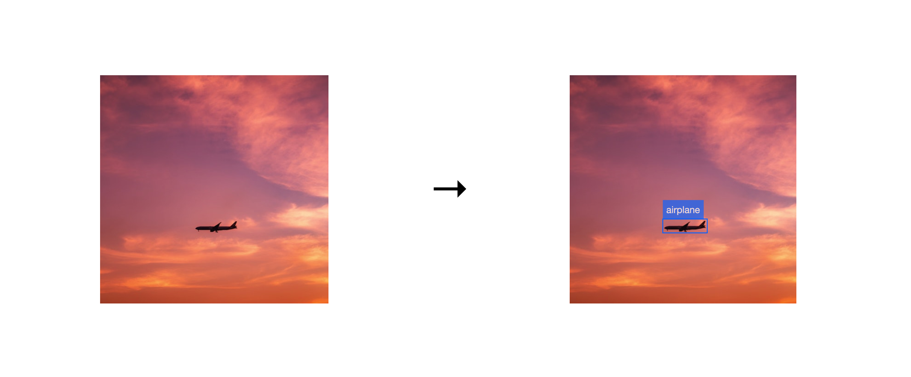

## Project Overview

One of the skills that machine-learning engineers can pick up which makes them more valuable to their employers is the ability to deploy front-end user interfaces for the models that they develop.

Historically, this has been a very complicated process, involving considerable domain knowledge in networking, virtualization and containerization, and cloud computing infrastructure. 

Today, it is much easier to make the results of machine learning available on the internet due to the development of ZEIT's Now global serverless deployment platform. 

For this example, we'll be deploying a Single Shot Multibox Detector image recognition machine learning model based on Google's MobileNetV2 neural network.  

## Deployment Instructions

1. Clone this repository to your local development environment.

`$ git clone https://github.com/jdamiba/object-detection.git`
`$ cd object-detection`

2. Deploy to `now`. 

`$ now`

3. Go to your deployment URL.

## Overview of SSDlite_MobileNetV2 

Developed by Liu et. al in 2016, the Single Shot Multibox Detector algorithm which creates bounding boxes around predicted objects in images. 



This model is awesome because it only requires a single neural network and also eliminates the need for a feature re-sampling stage. As a result, it can be trained more quickly and cheaply than other image recognition algorithms.

Further optimzations are achieved by training the model using Google's MobileNetV2 neural network, which was designed to do machine learning in the context of CPU-constrained mobile computing devices. 

## Overview of ZEIT Now

Now is a global serverless deployment platform, which means that it allows you to deploy machine learning models to the web without having to configure and manage a traditional web server. 

It can be installed as a command line utilty using `npm` or `yarn`. 

To deploy your applications, you simply run the `now` command in the terminal. Deployment settings can be managed by adding a `now.json` file in the root of your project directory. 

Get a feel for how easy it is to deploy sites to the web using Now:

1. `mkdir my_first_app && cd my_first_app`

2. `cat > index.html`

3. `<h1>hello, world!</h1>`

4. `now`

## Overview of Serverless Lambdas

Of course, deploying a web application which incorporates a machine learning model is more complex than deploying a single html file.

## Deploying SSDlite_MobileNetV2 as a Serverless Lambda

Our image recognition API will have one publicly accessible HTTP endpoint: `/predict`. 

If the request URL includes a `.jpg` or `.png` image, we will load both a pre-trained image recognition algorithm and the image into the client's memory. Then we'll send a response back with bounding boxes.

Otherwise, we will reply with an error message.

```js
if (req.url === '/api/predict') {
      const tf = await loadTf()
      const tfModel = await loadModel()

      const { type: mimeType } = contentType.parse(req)

      if (CONTENT_TYPES_IMAGE.includes(mimeType)) {
        const buf = await buffer(req, { limit: '5mb' })
        const { tensor, width, height } = await imgToTensor(buf)

        const { scores, boxes } = await predict(tfModel, tensor)

        const bboxes = await tensorsToBBoxes({ scores, boxes, width, height })

        return send(res, 200, bboxes)
      }

      throw BadRequestError('Only images are supported at the moment')
    }
```

### Front-end Structure

Our front-end interface is divided into two parts- a sidebar with an input section where images can be uploaded and a display area where the results are presented to the user.

When an image is uploaded, the front-end makes an API call to the back-end. Hopefully, it recieves as a response a JavaScript object which describes where it should draw bounding boxes.

For example, this image would return the following:


```json
[
  {
    "bbox": [{ "x": 205.61, "y": 315.36 }, { "x": 302.98, "y": 345.72 }],
    "class": "airplane",
    "score": 0.736
  }
]
```

In case users don't have an image handy, we'll provide them with options pulled from a public image API in the sidebar.

Instructions for using the app will also be in the sidebar.

If you want to read more about how this was made, [read the detailed article about it on ZEIT's blog](https://zeit.co/blog/serverless-machine-learning).
